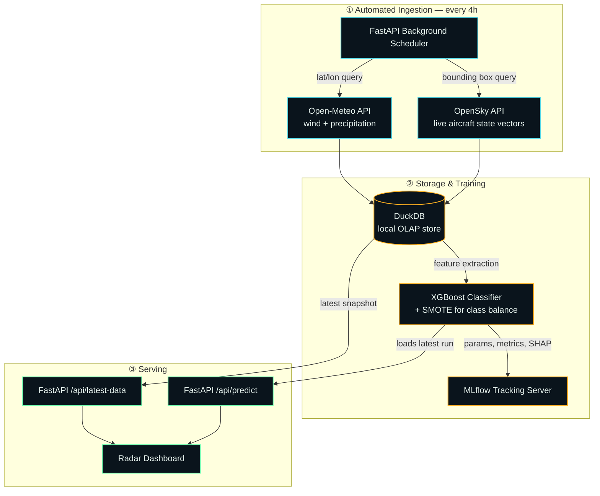

<div align="center">



<br/>


**A self-sustaining MLOps system that watches the sky over JFK and predicts disruption before it happens.**

No paid infrastructure. No cloud bill. Just live air-traffic state vectors, live weather, and a model that keeps learning.

</div>

---

## What this actually is

Most ML portfolio projects stop at a notebook and an accuracy score. This one doesn't stop — it *runs*. Every few hours, without anyone touching it, the system pulls live aircraft state vectors from OpenSky and live weather from Open-Meteo, folds them into a local warehouse, retrains, and serves a fresh disruption-risk prediction through a REST API and an ATC-style radar dashboard.

It's built to answer one question honestly: **can this pipeline still be trusted a week from now, with zero human babysitting, and zero infrastructure cost?**

## Live Radar Dashboard

The inference endpoint isn't just JSON in a terminal — it's rendered as a real-time radar scope, echoing the instrument it's modeling after.

<div align="center">

<br/>
<sub>Sweeping 3D radar (Three.js) · live telemetry console · risk-coded target blip</sub>
</div>

> Replace `assets/dashboard-demo.gif` with a real screen recording of your dashboard once it's deployed — a 5–8s loop of the sweep + a prediction updating is enough.

## Architecture

The pipeline runs on a strict, self-triggering cycle — no cron server, no external scheduler, no manual retraining.



## Why each piece is there

| Decision | Reasoning |
|---|---|
| **DuckDB over Postgres** | Time-series telemetry at this scale doesn't need a server process — an embedded OLAP file gives fast columnar queries with zero ops overhead. |
| **SMOTE before training** | Severe-delay events are rare. Without rebalancing, XGBoost just learns to predict "nothing's wrong" and looks accurate while being useless. |
| **MLflow, self-hosted** | Every retrain is logged — hyperparameters, metrics, SHAP feature-importance artifacts — so a model regression is traceable instead of a mystery. |
| **Background scheduler, not a queue** | At a 4-hour cadence with a single ingestion job, a threading scheduler inside the FastAPI process is simpler and cheaper than standing up Celery/Redis for the same guarantee. |
| **Docker Compose** | The API and MLflow server are two processes that need to agree on a network and a volume — Compose makes "works on my machine" also mean "works on any machine." |

## Tech stack

<table>
<tr>
<td valign="top" width="33%">

**Ingestion & Serving**
- FastAPI
- Uvicorn
- Python threading scheduler
- OpenSky Network API
- Open-Meteo API

</td>
<td valign="top" width="33%">

**Data & ML**
- DuckDB
- XGBoost
- SMOTE (imbalanced-learn)
- SHAP
- MLflow

</td>
<td valign="top" width="33%">

**Frontend & Ops**
- Three.js (radar scope)
- Tailwind CSS (compiled, no runtime JIT)
- Docker / Docker Compose

</td>
</tr>
</table>

## Project structure

```
flight-mlops/
├── app/
│   ├── ingest/            # OpenSky + Open-Meteo fetchers, run on schedule
│   ├── db/
│   │   ├── seed.py        # historical backfill for first run
│   │   └── schema.sql
│   ├── ml/
│   │   ├── train.py       # XGBoost + SMOTE, logs to MLflow
│   │   └── predict.py     # loads latest MLflow run for inference
│   ├── static/
│   │   ├── index.html     # radar dashboard
│   │   ├── script.js
│   │   └── styles.css     # compiled Tailwind — no CDN, no eval()
│   └── main.py             # FastAPI app + scheduler bootstrap
├── assets/
│   ├── radar-banner.svg
│   └── dashboard-demo.gif
├── docker-compose.yml
├── Dockerfile
└── requirements.txt
```

## Quickstart

The whole stack is containerized — one command boots the API, the scheduler, and MLflow together.

```bash
git clone <your-repo-url>
cd flight-mlops
docker compose up --build -d
```

**First run only** — seed historical context so the model has something to train on:

```bash
docker exec -it flight_mlops_api python app/db/seed.py
docker exec -it flight_mlops_api python app/ml/train.py
```

**Interfaces:**

| Service | URL | Purpose |
|---|---|---|
| Radar Dashboard | `http://localhost:8000` | Live telemetry + risk prediction |
| MLflow UI | `http://localhost:5000` | Experiment history, metrics, SHAP artifacts |

## API

| Endpoint | Method | Returns |
|---|---|---|
| `/api/latest-data` | `GET` | Most recent ingested traffic + weather snapshot |
| `/api/predict` | `GET` | Current disruption risk level + probability |

# Image


## Roadmap

- [ ] Swap the threading scheduler for APScheduler with persistent job state
- [ ] Add a `/api/history` endpoint to chart risk trend over the last 24h
- [ ] Extend beyond KJFK to a small multi-airport panel
- [ ] CI job that fails the build if retrain metrics regress past a threshold

---

<div align="center">

Built by **Abdul Raffay Qureshi** · Bioinformatics × ML × Systems

[](https://linkedin.com/in/your-profile)
[](https://github.com/AbdulRaffayQureshi)

</div>
